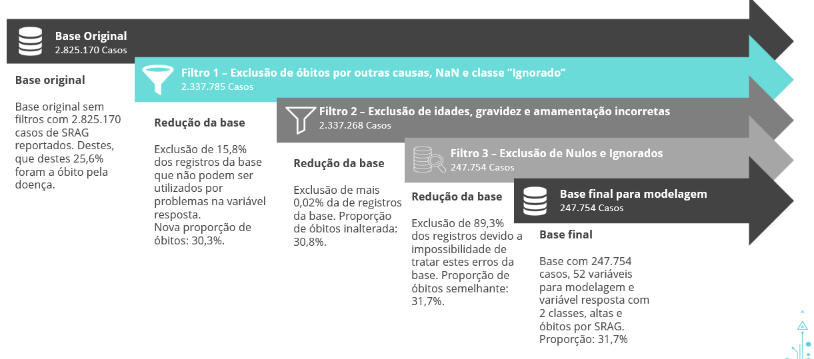

# Trabalho de Conclusão de Curso -- MBA Analytics Data Science FIA

A proposta do TCC de analytics da FIA é criar um estudo com modelagem estatística (regressão logística, linear, entre outros) e modelagem de aprendizado de máquina (modelos mais complexos como xgboost, lightgbm, entre outros) para tentar resolver um problema. Para tal, precisamos escolher uma base pública, que não deve ser base de competição, ou privada da sua própria empresa, para montarmos o estudo. No meu caso, escolhi as bases de SRAG (Síndrome Respiratória Aguda Grave) do DataSUS que mostram a evolução da doença em 2020 e 2021 juntamente com os dados da COVID.

A base de 2020 pode ser obtida [através deste link](https://opendatasus.saude.gov.br/dataset/srag-2020) e a base de 2021 pode ser obtida [aqui](https://opendatasus.saude.gov.br/dataset/srag-2021-e-2022). As bases são atualizadas periodicamente e, nem sempre, conseguimos baixar a mesma base que estamos trabalhando.

### Os objetivos do trabalho são:
* Identificar o que não pode faltar na triagem de um paciente com suspeita de SRAG, como sintomas, morbidades, entre outros;
* Entender como a COVID-19 impactou nos diagnósticos, número de casos, principais sintomas e óbitos da SRAG no Brasil e identificar a probabilidade de óbito e seus principais fatores de influência;
* Entender a evolução de um paciente que dá entrada em uma unidade do SUS com SRAG.

### A contextualização do problema é:

A síndrome respiratória aguda grave (SRAG) é uma doença desencadeada por uma lesão nos alvéolos pulmonares normalmente associada à inflamação e acúmulo de líquido nos pulmões. Entre os principais sintomas da SRAG estão a dificuldade de respirar, sensação de pressão no peito, lábios arroxeados e baixa oxigenação no sangue, podendo levar a sequelas permanentes e óbito. Os principais patógenos associados à SRAG são: os vírus Influenza, Adenovirus, vírus sincicial e a COVID-19.

Com o advento da COVID-19, em 2020 no Brasil, os casos de SRAG cresceram mais de 1.600%, com um aumento de 3.600% em casos que evoluíram para óbito, em comparação com o ano de 2019.

Desse modo, faz-se necessária uma análise mais a fundo para entender, historicamente, quais as variáveis analisadas de um paciente com SRAG até 2018, antes da pandemia, e quais são estes fatores hoje, com a pandemia de COVID-19, necessariamente, o que é olhado hoje.

Esta análise baseada em dados é uma ferramenta de suporte para hospitais privados e o SUS, para ser utilizada como auxílio na previsão de evolução do paciente com SRAG, possibilitando um cuidado mais individual para cada paciente, diminuindo as chances de óbito.

### As bases

As bases inicialmente possuíam 162 colunas e, juntas, 2.825.170 registros. Após o tratamento, terminamos com 52 variáveis e 247.754. A proporção entre 1 (óbito) e 0 (alta) é de 31,7%.

Os filtros aplicados foram:

Gostaria de comentar sobre o filtro que mais excluiu variáveis, o de remoção de "Ignorados" e "Nulos". A base veio com uma documentação, [Dicionario-2020.pdf](https://github.com/guilhermehge/Analises-e-modelagens-Data-Science/blob/main/Classifica%C3%A7%C3%A3o/Trabalho%20de%20conclus%C3%A3o%20de%20curso%20--%20MBA/Dicion%C3%A1rios%20das%20vari%C3%A1veis%20das%20bases/Dicionario-2020.pdf) e [Dicionario-2021.pdf](https://github.com/guilhermehge/Analises-e-modelagens-Data-Science/blob/main/Classifica%C3%A7%C3%A3o/Trabalho%20de%20conclus%C3%A3o%20de%20curso%20--%20MBA/Dicion%C3%A1rios%20das%20vari%C3%A1veis%20das%20bases/Dicionario-2021.pdf), que explica o que cada variável representa e seus possíveis resultados. Para muitas, temos 1 para Sim, 2 para Não e 9 para Ignorado, porém temos mais uma categoria especial, o valor NULO. Com o objetivo de tratar os dados, tentei por muito tempo tentar entender o que o ignorado e o nulo poderiam significar, porém não tenho contato com o time de negócios. Um dos testes que fiz segue na imagem abaixo:

Neste teste cruzei algumas variáveis (trouxe apenas duas na imagem) com a variável resposta para ver a proporção de óbito de cada categoria da variável. Neste caso: 1 - Sim, 2 - Não, 9 - Ignorado e 30 - Nulo. Podemos observar que, na variável "PERDA_OLFT" há mais óbitos nas categorias de "Nulo" e "Ignorado" que na categoria de "Sim", o que é contraintuitivo e pode bagunçar o modelo final. Já na variável "CARDIOPATI" observa-se que a proporção de óbitos entre "Sim" e "Ignorado" é semelhante, o que também é confuso. Por isso, decidi por eliminar todos os valores "Ignorados" e "Nulos" de todas as variáveis, o que resultou num encolhimento de mais de 90% da base inicial.

O tratamento das variáveis pré-eliminação dos nulos e ignorados está no notebook [Tratamento_variaveis_2020_2021.ipynb](https://github.com/guilhermehge/Analises-e-modelagens-Data-Science/blob/main/Classifica%C3%A7%C3%A3o/Trabalho%20de%20conclus%C3%A3o%20de%20curso%20--%20MBA/Modelagem%20e%20Tratamento/Tratamento_variaveis_2020_2021.ipynb).

As variáveis pós-tratamento são, por categoria:

* Variáveis de Data, demográficas e geográficas
	- Data da notificação
	- Tempo de alta ou óbito 
	- UF
	- Sexo
	- Idade
	- Gravidez
	- Raça
	- Vacinação contra gripe
	- Mãe amamenta (< 6 meses)
	- Mãe vacinada contra gripe (< 6 meses)
	- Vacina contra COVID-19

* Sintomas
	- Febre
	- Tosse
	- Dispneia
	- Diarreia
	- Vômito
	- Garganta
	- Desconforto respiratório
	- Saturação abaixo de 95%
	- Dor abdominal
	- Fadiga
	- Perda olfativa
	- Perda de paladar

* Fatores de risco (comorbidades)
	- Hematológica
	- Cardiopatia
	- Asma
	- Diabetes
	- Pneumopatia
	- Renal
	- Imunodepressão
	- Hepática
	- Neurológica
	- Obesidade
	- Puérpera (que deu a luz recentemente)
	- Síndrome de down

Doença e diagnóstico
	- Diagnóstico final
	- Internação em UTI
	- Utilizou suporte ventilatório
	- Diagnóstico para Parainfluenza 1, 2, 3 e 4
	- Diagnóstico adenovírus
	- Diagnóstico influenza
	- Diagnóstico para VSR
	- Diagnóstico para Bocavírus
	- Diagnóstico para Rinovírus
	- Diagnóstico para Metapneumovírus
	- Diagnóstico para Sars-CoV-2
	- Utilizou Antiviral

* Variável alvo (EVOLUCAO)
	- 1 – Óbito
	- 0 – Alta por cura

Após a análise exploratória, terminamos com 36 variáveis para modelagem, elas são:

* Sexo
* Diagnóstico Final
* Uso de suporte ventilatório
* Vacinação COVID-19
* Idade
* Tempo de atendimento
* Gravidez
* Mãe Amamenta
* Mãe vacinada contra gripe
* Problema hematológico
* Cardiopatia
* Asma
* Diabetes
* Pneumopatia
* Problema Renal
* Imunodeprimido
* Problema hepático
* Condição Neurológica
* Obesidade
* Puérpera
* Síndrome de Down
* Febre
* Tosse
* Dispneia
* Diarreia
* Vômito
* Dor de Garganta
* Desconforto Respiratório
* Baixa saturação
* Dor Abdominal
* Fadiga
* Perda Olfativa
* Perda de paladar
* Foi para a UTI
* Vacina de Gripe
* Fez uso de Antiviral.

**Detalhes sobre as modelagens estarão no README.md da [pasta de Modelagem e Tratamento](https://github.com/guilhermehge/Analises-e-modelagens-Data-Science/tree/main/Classifica%C3%A7%C3%A3o/Trabalho%20de%20conclus%C3%A3o%20de%20curso%20--%20MBA/Modelagem%20e%20Tratamento)**

**Mais detalhes sobre a análise podem ser encontrados na apresentação em PowerPoint [TCC-FIA-GuilhermeElias.pptx](https://github.com/guilhermehge/Analises-e-modelagens-Data-Science/blob/main/Classifica%C3%A7%C3%A3o/Trabalho%20de%20conclus%C3%A3o%20de%20curso%20--%20MBA/Apresenta%C3%A7%C3%A3o%20PowerPoint/TCC-FIA-GuilhermeElias.pptx)**. A apresentação ainda não é final pois o projeto ainda não está 100% pronto e há mais uma etapa de entrega.