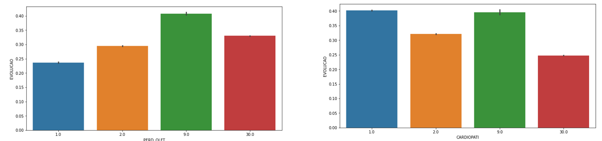
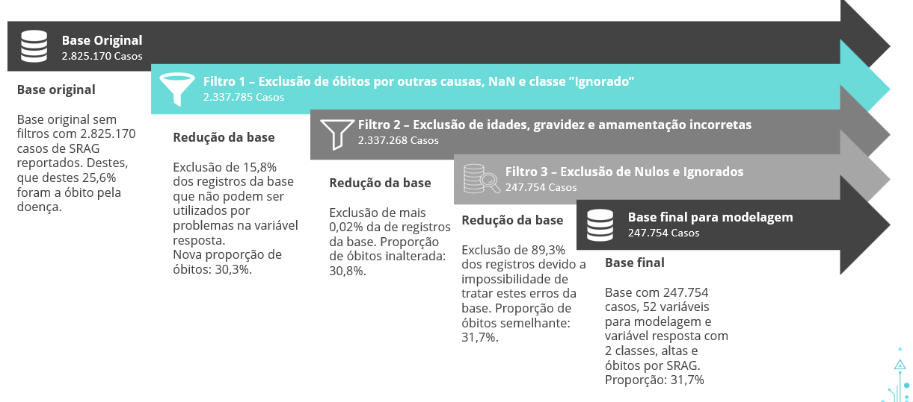

# English Version

## MBA Final Thesis

The proposal of the FIA analytics final thesis is to create a study with statistical modeling (logistic regression, linear, among others) and machine learning modeling (more complex models such as xgboost, lightgbm, among others) to try to solve a problem. To do so, we need to choose a public database, which should not be a competition database, or a private one from your own company, to set up the study. In my case, I chose the SARS (Severe Acute Respiratory Syndrome) databases from DataSUS that show the evolution of the disease in 2020 and 2021 together with COVID data.

_All the notebooks and presentations are in portuguese, since the work was presented in a brazilian educational instituion._

The 2020 database can be obtained [through this link](https://opendatasus.saude.gov.br/dataset/srag-2020) and the 2021 database can be obtained [here](https://opendatasus.saude.gov.br/dataset/srag-2021-a-2023). The databases are updated periodically and we are not always able to download the same base we are working on.

### The goals of the assignment are:
* Identify what cannot be missing in the triage of a patient with suspected SARS, such as symptoms, morbidities, among others;
* Understand how COVID-19 has impacted the diagnoses, number of cases, main symptoms and deaths of SARS in Brazil and identify the probability of death and its main influencing factors;
* Understand the evolution of a patient admitted to a SUS unit with SARS.

### The contextualization of the problem is:

Severe acute respiratory syndrome (SARS) is a disease triggered by an injury to the lung alveoli usually associated with inflammation and fluid accumulation in the lungs. Among the main symptoms of SARS are difficulty breathing, a feeling of pressure in the chest, purplish lips and low blood oxygenation, which can lead to permanent damage and death. The main pathogens associated with SARS are: Influenza viruses, Adenovirus, syncytial virus and COVID-19.

With the advent of COVID-19, in 2020 in Brazil, SARS cases grew by more than 1,600%, with an increase of 3,600% in cases that evolved to death, compared to the year 2019.

Thus, a more in-depth analysis is necessary to understand, historically, what variables were analyzed of a patient with SARS until 2018, before the pandemic, and what are these factors today, with the COVID-19 pandemic, necessarily, what is looked at today.

This data-based analysis is a support tool for private hospitals and the SUS, to be used as an aid in predicting the evolution of the patient with SARS, enabling more individual care for each patient, reducing the chances of death.

### The databases

The bases initially had 162 columns and, together, 2,825,170 records. After treatment, we ended up with 52 variables and 247,754. The proportion between 1 (death) and 0 (discharge) is 31.7%.

I would like to comment on the filter that excluded the most variables, that of removing "Ignored" and "Null". The database came with a documentation, [Dicionario-2020.pdf](https://github.com/guilhermehge/modeling-and-analyses-DS/blob/main/classification/mba_thesis/variable_dictionaries/Dicionario-2020.pdf) and [Dicionario-2021.pdf](https://github.com/guilhermehge/modeling-and-analyses-DS/blob/main/classification/mba_thesis/variable_dictionaries/Dicionario-2021.pdf), which explains what each variable represents and its possible results. For many, we have 1 for Yes, 2 for No and 9 for Ignored, but we have one more special category, the NULL value. In order to process the data, I tried for a long time to understand what ignored and null could mean, but I have no contact with the business team. One of the tests I did follows in the image below:

In this test I crossed some variables (I brought only two in the image) with the response variable to see the proportion of death of each category of the variable. In this case: 1 - Yes, 2 - No, 9 - Ignored and 30 - Null. We can observe that, in the variable " PERDA_OLFT" there are more deaths in the categories of "Null" and "Ignored" than in the category of "Yes", which is counterintuitive and can mess up the final model. In the variable "CARDIOPATI", the proportion of deaths between "Yes" and " Ignored" is similar, which is also confusing. Therefore, I decided to eliminate all "Ignored" and "Null" values from all variables, which resulted in a shrinkage of more than 90% of the initial database.

The treatment of variables pre-elimination of nulls and ignored is in the notebook [Treatment_variables_2020_2021.ipynb](https://github.com/guilhermehge/modeling-and-analyses-DS/blob/main/classification/mba_thesis/data_cleaning_and_modelling/Tratamento_variaveis_2020_2021.ipynb).

Post-treatment variables are, by category:

* Date, demographic and geographic variables
	- Date of notification
	- Time of discharge or death 
	- UF
	- Sex
	- Age
	- Pregnancy
	- Race
	- Influenza vaccination
	- Breastfeeding mother (< 6 months)
	- Mother vaccinated against influenza (< 6 months)
	- COVID-19 vaccine

* Symptoms
	- Fever
	- Cough
	- Dyspnea
	- Diarrhea
	- Vomiting
	- Throat
	- Respiratory distress
	- Saturation below 95%
	- Abdominal pain
	- Fatigue
	- Loss of smell
	- Loss of taste

* Risk factors (comorbidities)
	- Hematologic
	- Cardiopathy
	- Asthma
	- Diabetes
	- Pneumopathy
	- Renal
	- Immunodepression
	- Hepatic
	- Neurological
	- Obesity
	- Puerperal (recently given birth)
	- Down syndrome

* Disease and diagnosis
	- Final diagnosis
	- ICU admission
	- Used ventilatory support
	- Diagnosis for Parainfluenza 1, 2, 3 and 4
	- Diagnosis adenovirus
	- Influenza diagnosis
	- Diagnosis for RSV
	- Diagnosis for Bocavirus
	- Diagnosis for Rhinovirus
	- Diagnosis for Metapneumovirus
	- Diagnosis for Sars-CoV-2
	- Used Antiviral

* Target variable (EVOLUTION)
	- 1 - Death
	- 0 - Discharge due to cure

After the exploratory analysis, we ended up with 36 variables for modeling, they are:

* Gender
* Final Diagnosis
* Use of ventilatory support
* COVID-19 vaccination
* Age
* Length of time in care
* Pregnancy
* Mother Breastfeeding
* Mother vaccinated against flu
* Hematological problem
* Heart disease
* Asthma
* Diabetes
* Pneumopathy
* Kidney problem
* Immunosuppressed
* Liver Problem
* Neurological Condition
* Obesity
* Puerperal
* Down Syndrome
* Fever
* Cough
* Dyspnea
* Diarrhea
* Vomiting
* Sore Throat
* Respiratory distress
* Low saturation
* Abdominal Pain
* Fatigue
* Loss of smell
* Loss of taste
* Went to ICU
* Flu Vaccine
* Took antiviral drugs.

**Details about the modeling will be in the README.md of the [data_cleaning_and_modeling folder](https://github.com/guilhermehge/modeling-and-analyses-DS/blob/main/classification/mba_thesis/data_cleaning_and_modelling/README.md)**.

**Further details on the analysis can be found in the PowerPoint presentation [TCC-FIA-GuilhermeElias.pptx](https://github.com/guilhermehge/modeling-and-analyses-DS/blob/main/classification/mba_thesis/presentation_pptx/TCC-FIA-GuilhermeElias.pptx)**.

# Versão em Português

## Trabalho de Conclusão de Curso - MBA Analytics Data Science FIA

A proposta do TCC de analytics da FIA é criar um estudo com modelagem estatística (regressão logística, linear, entre outros) e modelagem de aprendizado de máquina (modelos mais complexos como xgboost, lightgbm, entre outros) para tentar resolver um problema. Para tal, precisamos escolher uma base pública, que não deve ser base de competição, ou privada da sua própria empresa, para montarmos o estudo. No meu caso, escolhi as bases de SRAG (Síndrome Respiratória Aguda Grave) do DataSUS que mostram a evolução da doença em 2020 e 2021 juntamente com os dados da COVID.

A base de 2020 pode ser obtida [através deste link](https://opendatasus.saude.gov.br/dataset/srag-2020) e a base de 2021 pode ser obtida [aqui](https://opendatasus.saude.gov.br/dataset/srag-2021-a-2023). As bases são atualizadas periodicamente e, nem sempre, conseguimos baixar a mesma base que estamos trabalhando.

### Os objetivos do trabalho são:
* Identificar o que não pode faltar na triagem de um paciente com suspeita de SRAG, como sintomas, morbidades, entre outros;
* Entender como a COVID-19 impactou nos diagnósticos, número de casos, principais sintomas e óbitos da SRAG no Brasil e identificar a probabilidade de óbito e seus principais fatores de influência;
* Entender a evolução de um paciente que dá entrada em uma unidade do SUS com SRAG.

### A contextualização do problema é:

A síndrome respiratória aguda grave (SRAG) é uma doença desencadeada por uma lesão nos alvéolos pulmonares normalmente associada à inflamação e acúmulo de líquido nos pulmões. Entre os principais sintomas da SRAG estão a dificuldade de respirar, sensação de pressão no peito, lábios arroxeados e baixa oxigenação no sangue, podendo levar a sequelas permanentes e óbito. Os principais patógenos associados à SRAG são: os vírus Influenza, Adenovirus, vírus sincicial e a COVID-19.

Com o advento da COVID-19, em 2020 no Brasil, os casos de SRAG cresceram mais de 1.600%, com um aumento de 3.600% em casos que evoluíram para óbito, em comparação com o ano de 2019.

Desse modo, faz-se necessária uma análise mais a fundo para entender, historicamente, quais as variáveis analisadas de um paciente com SRAG até 2018, antes da pandemia, e quais são estes fatores hoje, com a pandemia de COVID-19, necessariamente, o que é olhado hoje.

Esta análise baseada em dados é uma ferramenta de suporte para hospitais privados e o SUS, para ser utilizada como auxílio na previsão de evolução do paciente com SRAG, possibilitando um cuidado mais individual para cada paciente, diminuindo as chances de óbito.

### As bases

As bases inicialmente possuíam 162 colunas e, juntas, 2.825.170 registros. Após o tratamento, terminamos com 52 variáveis e 247.754. A proporção entre 1 (óbito) e 0 (alta) é de 31,7%.

Os filtros aplicados foram:

Gostaria de comentar sobre o filtro que mais excluiu variáveis, o de remoção de "Ignorados" e "Nulos". A base veio com uma documentação, [Dicionario-2020.pdf](https://github.com/guilhermehge/modeling-and-analyses-DS/blob/main/classification/mba_thesis/variable_dictionaries/Dicionario-2020.pdf) e [Dicionario-2021.pdf](https://github.com/guilhermehge/modeling-and-analyses-DS/blob/main/classification/mba_thesis/variable_dictionaries/Dicionario-2021.pdf), que explica o que cada variável representa e seus possíveis resultados. Para muitas, temos 1 para Sim, 2 para Não e 9 para Ignorado, porém temos mais uma categoria especial, o valor NULO. Com o objetivo de tratar os dados, tentei por muito tempo tentar entender o que o ignorado e o nulo poderiam significar, porém não tenho contato com o time de negócios. Um dos testes que fiz segue na imagem abaixo:

Neste teste cruzei algumas variáveis (trouxe apenas duas na imagem) com a variável resposta para ver a proporção de óbito de cada categoria da variável. Neste caso: 1 - Sim, 2 - Não, 9 - Ignorado e 30 - Nulo. Podemos observar que, na variável "PERDA_OLFT" há mais óbitos nas categorias de "Nulo" e "Ignorado" que na categoria de "Sim", o que é contraintuitivo e pode bagunçar o modelo final. Já na variável "CARDIOPATI" observa-se que a proporção de óbitos entre "Sim" e "Ignorado" é semelhante, o que também é confuso. Por isso, decidi por eliminar todos os valores "Ignorados" e "Nulos" de todas as variáveis, o que resultou num encolhimento de mais de 90% da base inicial.

O tratamento das variáveis pré-eliminação dos nulos e ignorados está no notebook [Tratamento_variaveis_2020_2021.ipynb](https://github.com/guilhermehge/modeling-and-analyses-DS/blob/main/classification/mba_thesis/data_cleaning_and_modelling/Tratamento_variaveis_2020_2021.ipynb).

As variáveis pós-tratamento são, por categoria:

* Variáveis de Data, demográficas e geográficas
	- Data da notificação
	- Tempo de alta ou óbito 
	- UF
	- Sexo
	- Idade
	- Gravidez
	- Raça
	- Vacinação contra gripe
	- Mãe amamenta (< 6 meses)
	- Mãe vacinada contra gripe (< 6 meses)
	- Vacina contra COVID-19

* Sintomas
	- Febre
	- Tosse
	- Dispneia
	- Diarreia
	- Vômito
	- Garganta
	- Desconforto respiratório
	- Saturação abaixo de 95%
	- Dor abdominal
	- Fadiga
	- Perda olfativa
	- Perda de paladar

* Fatores de risco (comorbidades)
	- Hematológica
	- Cardiopatia
	- Asma
	- Diabetes
	- Pneumopatia
	- Renal
	- Imunodepressão
	- Hepática
	- Neurológica
	- Obesidade
	- Puérpera (que deu a luz recentemente)
	- Síndrome de down

* Doença e diagnóstico
	- Diagnóstico final
	- Internação em UTI
	- Utilizou suporte ventilatório
	- Diagnóstico para Parainfluenza 1, 2, 3 e 4
	- Diagnóstico adenovírus
	- Diagnóstico influenza
	- Diagnóstico para VSR
	- Diagnóstico para Bocavírus
	- Diagnóstico para Rinovírus
	- Diagnóstico para Metapneumovírus
	- Diagnóstico para Sars-CoV-2
	- Utilizou Antiviral

* Variável alvo (EVOLUCAO)
	- 1 – Óbito
	- 0 – Alta por cura

Após a análise exploratória, terminamos com 36 variáveis para modelagem, elas são:

* Sexo
* Diagnóstico Final
* Uso de suporte ventilatório
* Vacinação COVID-19
* Idade
* Tempo de atendimento
* Gravidez
* Mãe Amamenta
* Mãe vacinada contra gripe
* Problema hematológico
* Cardiopatia
* Asma
* Diabetes
* Pneumopatia
* Problema Renal
* Imunodeprimido
* Problema hepático
* Condição Neurológica
* Obesidade
* Puérpera
* Síndrome de Down
* Febre
* Tosse
* Dispneia
* Diarreia
* Vômito
* Dor de Garganta
* Desconforto Respiratório
* Baixa saturação
* Dor Abdominal
* Fadiga
* Perda Olfativa
* Perda de paladar
* Foi para a UTI
* Vacina de Gripe
* Fez uso de Antiviral.

**Detalhes sobre as modelagens estarão no README.md da [pasta data_cleaning_and_modeling](https://github.com/guilhermehge/modeling-and-analyses-DS/blob/main/classification/mba_thesis/data_cleaning_and_modelling/README.md)**

**Mais detalhes sobre a análise podem ser encontrados na apresentação em PowerPoint [TCC-FIA-GuilhermeElias.pptx](https://github.com/guilhermehge/modeling-and-analyses-DS/blob/main/classification/mba_thesis/presentation_pptx/TCC-FIA-GuilhermeElias.pptx)**.