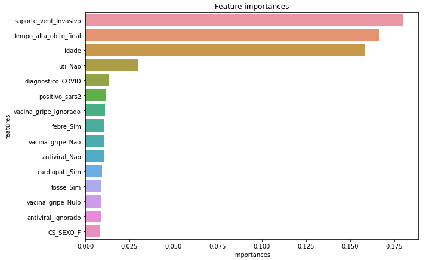
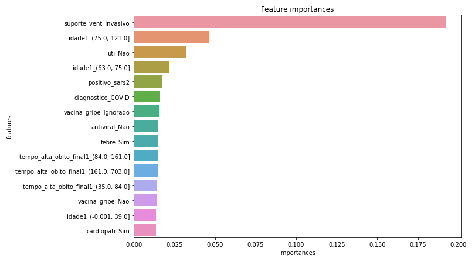
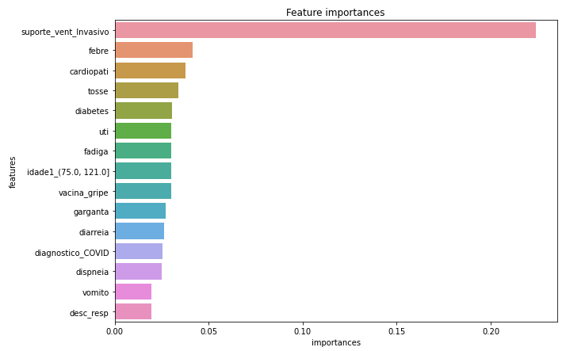
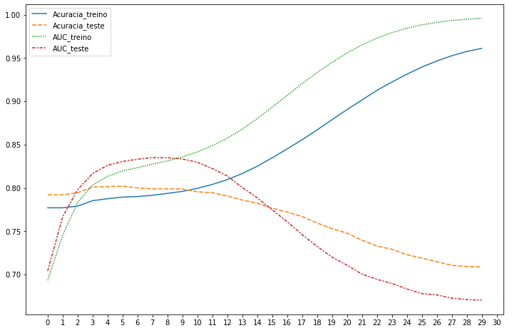
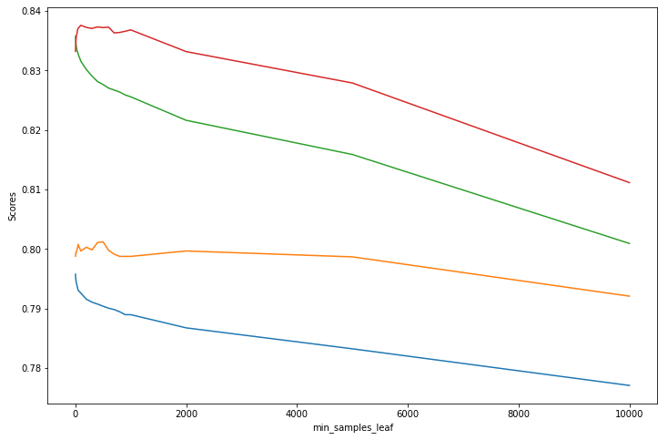
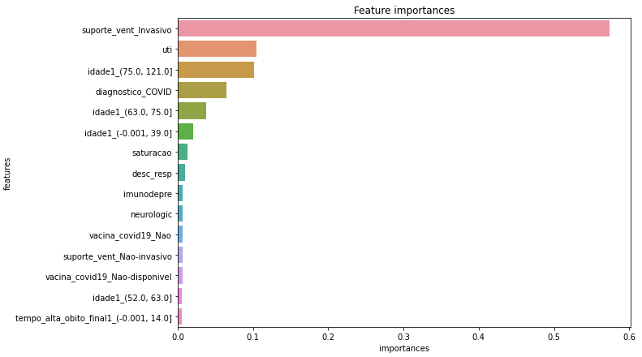
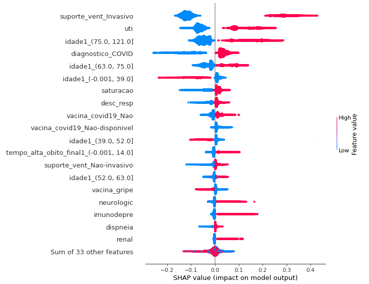

# English Version

## MBA Final Thesis

### Modeling and variable treatment

#### [initial_tests](https://github.com/guilhermehge/modeling-and-analyses-DS/blob/main/classification/mba_thesis/data_cleaning_and_modeling/initial_tests)

I started modeling with statistical modeling. Initially, I modeled using the variables "Idade (Age)" and "Tempo de alta ou óbito (Time of discharge or death)" as numerical and all other variables as categorical or dummies. Also, at this stage, I had not yet removed the ignored and null from the base. Notebook in question: [modeling_2020_2021-tree.ipynb](https://github.com/guilhermehge/modeling-and-analyses-DS/blob/main/classification/mba_thesis/data_cleaning_and_modeling/initial_tests/modeling_2020_2021-tree.ipynb)

The database used can't be uploaded here, since it has more than 400mb and GitHub only allows files with less than 100mb. If you want access to it, send me a message.

I chose to build a decision tree and, as result, we have the feature importance plot of the baseline model:

It is possible to observe that "Idade (Age)" and "Tempo de alta ou óbito (Time of discharge or death)" have a strong importance in the model, however, as they are numerical variables and have high cardinality, that is, they allow infinite breaks, naturally they would already be classified as variables of high importance, as indicated by the [sklearn decision tree documentation](https://scikit-learn.org/stable/modules/generated/sklearn.tree.DecisionTreeClassifier.html#:~:text=Warning%3A%20impurity%2Dbased%20feature%20importances%20can%20be%20misleading%20for%20high%20cardinality%20features). In addition, it is possible to observe that "Ignored" and "Null" classes appear in the feature importance plot, which makes the interpretability of the results difficult. The rest of the notebook is an attempt to optimize some hyperparameters of the model without using advanced techniques, since it was the proposal of the delivery, but the above problems made it difficult to continue using the database as it was.

Thus, I decided to initially transform the variables "Idade (Age)" and "Tempo de alta ou óbito (Time of discharge or death)" into categorical ones and model from there. Notebook in question: [modeling_age_and_time_in_hospital_categorical_2020_2021.ipynb](https://github.com/guilhermehge/modeling-and-analyses-DS/blob/main/classification/mba_thesis/data_cleaning_and_modeling/initial_tests/modeling_age_and_time_in_hospital_categorical_2020_2021.ipynb).

O feature importance of the baseline model was:

We see that we now have elderly people with high importance and the time of discharge or death has decreased its importance, which confirms the bias of the high cardinality of the variables. Despite being an evolution, we can still see categories of "Ignored" in the graph, which hinders the interpretability of the model. The rest of the notebook follows the same line as the previous one.

#### [final_modeling](https://github.com/guilhermehge/modeling-and-analyses-DS/blob/main/classification/mba_thesis/data_cleaning_and_modeling/final_modeling) (statistical)

**Decision tree**

With the knowledge above acquired, I removed the "Ignored" and "Null" from the base and transformed "Age" and "Time to discharge and death" into categorical variables, or, in this case, dummies.

The final statistical modeling is in the notebook [statistical_modeling_remove_ignored_nulls.ipynb](https://github.com/guilhermehge/modeling-and-analyses-DS/blob/main/classification/mba_thesis/data_cleaning_and_modeling/final_modeling/statistical_modeling_remove_ignored_nulls.ipynb).
The database used can't be uploaded here, since it has more than 400mb and GitHub only allows files with less than 100mb. If you want access to it, send me a message.

The feature importance of the baseline model was:

It is noticeable that now the variables of the plot are quite different from the previous ones. We can see that some symptoms and comorbidities are crucial factors in the assembly of the tree for determining death or discharge. The elderly continue to have a strong importance as well, as does the diagnosis of COVID itself.

With these satisfactory results, I decided to continue this modeling and modify the hyperparameters of the tree, however, at this stage of the work, I was not allowed to use more advanced tuning techniques. In this case, I used basic loops to test the depth of the trees and the number of samples in each leaf (min_samples_leaf).

The results were:

Tree depth:

min_samples_leaf:

Thus, a value of 10 for the depth is a good value because it is the point at which the AUC of the test begins to drop and generates a relatively readable tree, since we have 36 variables being modeled. The min_samples_leaf of 100 seems to be a good value, since the AUC only drops with the increase of this value.

The final tree is in the file [tree_10_100_semignull.pdf](https://github.com/guilhermehge/modeling-and-analyses-DS/blob/main/classification/mba_thesis/data_cleaning_and_modeling/final_modeling/tree_10_100_semignull.pdf).

The results of the model with the tuned hyperparameters were:

* Accuracy: 0.75
* Sensitivity: 0.77
* Specificity: 0.74
* Accuracy: 0.57
* F1: 0,66

The feature importance of this model was:

We observe that the use of invasive ventilatory support (var: suporte_vent_Invasivo) is the most important variable in the model followed by ICU visit (var: UTI) and age 75 to 121 (var: idade1_(75.0, 121.0]). We also see that some comorbidities appear together with some symptoms and the COVID-19 vaccine.

The SHAP plot of the model was:

With the SHAP plot we can get a better idea of how each variable influences the model in order of importance.

The variable "suporte_vent_Invasivo (Invasive ventilatory support)" is the most important in determining patient death. We were also able to see that going to the ICU (UTI), being over 63 years old, diagnosis of COVID, low saturation, respiratory discomfort, **not vaccinating against COVID-19**, kidney problems, immunosuppression, among other comorbidities, corroborate the death of the SARS patient.

I then tried to change the model's cut-off point, but the results did not change much.

**Logistic Regression**

The logistic regression provides the coefficients of each variable inserted in the model, so we can use the logistic regression equation to determine the chance of death of a patient. The coefficients obtained with the tuned model can be seen in the presentation [TCC-FIA-GuilhermeElias.pptx](https://github.com/guilhermehge/modeling-and-analyses-DS/blob/main/classification/mba_thesis/presentation_pptx/TCC-FIA-GuilhermeElias.pptx).

The results of the model were:

* Accuracy: 0.77
* Sensitivity: 0.75
* Specificity: 0.77
* Accuracy: 0.59
* F1: 0,66

Results close to those of the decision tree. As the tree is a model with better interpretability, it is preferable to logistic regression from a business point of view.

#### [final_modeling](https://github.com/guilhermehge/modeling-and-analyses-DS/blob/main/classification/mba_thesis/data_cleaning_and_modeling/final_modeling) (machine learning)

Notebook in question: [auto_ml_modeling.ipynb](https://github.com/guilhermehge/modeling-and-analyses-DS/blob/main/classification/mba_thesis/data_cleaning_and_modeling/final_modeling/auto_ml_modeling.ipynb)

To be continued...

# Versão em Português

## Trabalho de Conclusão de Curso -- MBA Analytics Data Science FIA

### Modelagem e tratamento das variáveis

#### Modelagens Iniciais

Comecei fazendo a modelagem pela modelagem estatística. Inicialmente fiz a modelagem utilizando as variáveis "Idade" e "Tempo de alta ou óbito" como numéricas e todas as outras variáveis como categóricas ou dummies. Além disso, nesta etapa, ainda não havia removido os ignorados e nulos da base. Notebook em questão: [modeling_2020_2021-tree.ipynb](https://github.com/guilhermehge/modeling-and-analyses-DS/blob/main/classification/mba_thesis/data_cleaning_and_modeling/initial_tests/modeling_2020_2021-tree.ipynb).

O banco de dados usado não pode ser carregado aqui, pois tem mais de 400 MB e o GitHub só permite arquivos com menos de 100 MB. Se quiser ter acesso a ele, envie-me uma mensagem.

Escolhi o modelo de árvore para modelar e, como resultado, segue o "feature importance" do modelo base:

É possível observar que "Idade" e "Tempo de alta ou óbito" possuem uma forte importância no modelo, porém, como são variáveis numéricas e possuem alta cardinalidade, ou seja, possibilitam infinitas quebras, naturalmente seriam já classificadas como variáveis de alta importância, conforme indica a [documentação da árvore de decisão do sklearn](https://scikit-learn.org/stable/modules/generated/sklearn.tree.DecisionTreeClassifier.html#:~:text=Warning%3A%20impurity%2Dbased%20feature%20importances%20can%20be%20misleading%20for%20high%20cardinality%20features). Além disso, é possível observar que aparecem classes "Ignorado" e "Nulo" no gráfico de feature importance, o que dificulta a interpretabilidade dos resultados. O restante do notebook é uma tentativa de otimizar alguns hiperparâmetros do modelo sem utilizar técnicas avançadas, uma vez que era a proposta da entrega, porém os problemas acima dificultavam continuar utilizando o banco de dados da forma que estava.

Desse modo, decidi, inicialmente, por transformar as variáveis "Idade" e "Tempo de alta ou óbito" em categóricas e modelar a partir disso. Notebook em questão: [modeling_age_and_time_in_hospital_categorical_2020_2021.ipynb](https://github.com/guilhermehge/modeling-and-analyses-DS/blob/main/classification/mba_thesis/data_cleaning_and_modeling/initial_tests/modeling_age_and_time_in_hospital_categorical_2020_2021.ipynb).

O feature importance do modelo base então foi:

Observa-se que agora temos idosos com alta importância e o tempo de alta ou óbito diminuiu sua importância, o que confirma o viés da alta cardinalidade das variáveis. Apesar de ser uma evolução, ainda conseguimos ver categorias de "Ignorado" no gráfico, o que dificulta a interpretabilidade do modelo. O restante do notebook segue na mesma linha do anterior.

#### Modelagens Finais (estatísticas)

**Árvore de decisão**

Com os conhecimentos acima adquiridos, removi os "Ignorados" e "Nulos" da base e transformei "Idade" e "Tempo de alta e óbito" em variáveis categóricas, ou, no caso, dummies.

A modelagem estatística final está no notebook [statistical_modeling_remove_ignored_nulls.ipynb](https://github.com/guilhermehge/modeling-and-analyses-DS/blob/main/classification/mba_thesis/data_cleaning_and_modeling/final_modeling/statistical_modeling_remove_ignored_nulls.ipynb).
O banco de dados usado não pode ser carregado aqui, pois tem mais de 400 MB e o GitHub só permite arquivos com menos de 100 MB. Se quiser ter acesso a ele, envie-me uma mensagem.

O feature importance do obtido do modelo base foi:

Observa-se que agora as variáveis do gráfico são bem diferentes dos anteriores. Conseguimos ver que alguns sintomas e comorbidades são fatores cruciais na montagem da árvore para a determinação do óbito ou da alta. Os idosos seguem com forte importância também, assim como o diagnóstico de COVID em si.

Com estes resultados satisfatórios, decidi por continuar esta modelagem e modificar os hiperparâmetros da árvore, porém, nesta etapa do trabalho, não era permitido utilizar técnicas mais avançadas de tuning. No caso, utilizei loops básicos para testar a profundidade das árvores e o número de amostras em cada folha (min_samples_leaf).

Os resultados obtidos foram

Profundidade:

min_samples_leaf:

Desse modo, um valor de 10 para a profundidade é um valor bom pois é o ponto em que o AUC do teste começa a cair e gera uma árvore relativamente legível, já que temos 36 variáveis sendo modeladas. Já o min_samples_leaf de 100 parece ser um bom valor, já que os AUC só caem com o aumento deste valor.

A árvore final está no arquivo [tree_10_100_semignull.pdf](https://github.com/guilhermehge/modeling-and-analyses-DS/blob/main/classification/mba_thesis/data_cleaning_and_modeling/final_modeling/tree_10_100_semignull.pdf).

Os resultados do modelo com os hiperparâmetros ajustados foram:

* Acurácia: 0,75
* Sensibilidade: 0,77
* Especificidade: 0,74
* Precisão: 0,57
* F1: 0,66

O feature importance do modelo segue abaixo:

Observamos que o uso de suporte ventilatório invasivo é a variável mais importante do modelo seguido de ida para a UTI e idade de 75 a 121 anos. Vemos também que algumas comorbidades aparecem juntamente com alguns sintomas e a vacina da COVID-19.

O gráfico SHAP do modelo é:

Com o gráfico SHAP conseguimos ter uma noção melhor de como cada variável influencia no modelo em ordem de importância.

A variável "Suporte ventilatório invasivo" é a mais importante na determinação do óbito do paciente. Conseguimos ver também que ir a UTI, ter idade acima de 63 anos, diagnóstico de COVID, baixa satuação, desconforto respiratório, **não vacinar contra COVID-19**, problemas renais, imunossupressão, entre outras comorbidades, corroboram com o óbito do paciente de SRAG.

Em seguida, tentei alterar o ponto de corte do modelo, porém os resultados não mudaram muito.

**Regressão Logística**

A regressão logística traz os coeficientes de cada variável inserida no modelo, com isto, podemos utilizar a equação da regressão logística para determinar a chance de óbito de um paciente. Os coeficientes obtidos com o modelo tunado podem ser vistos na apresentação [TCC-FIA-GuilhermeElias.pptx](https://github.com/guilhermehge/modeling-and-analyses-DS/blob/main/classification/mba_thesis/presentation_pptx/TCC-FIA-GuilhermeElias.pptx).

Os resultados do modelo foram:

* Acurácia: 0,77
* Sensibilidade: 0,75
* Especificidade: 0,77
* Precisão: 0,59
* F1: 0,66

Resultados próximos ao da árvore de decisão. Como a árvore é um modelo com melhor interpretabilidade, é preferível frente a regressão logística do ponto de vista de negócio.

#### Modelagens Finais (aprendizado de máquina)

Notebook em questão: [auto_ml_modeling.ipynb](https://github.com/guilhermehge/modeling-and-analyses-DS/blob/main/classification/mba_thesis/data_cleaning_and_modeling/final_modeling/auto_ml_modeling.ipynb)

A ser adicionado!!

