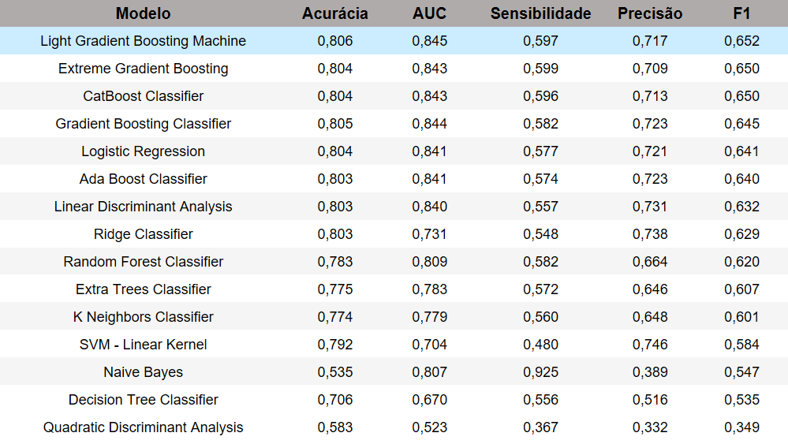

# English Version

## MBA Final Thesis

### Modeling and variable treatment

#### [initial_tests](https://github.com/guilhermehge/modeling-and-analyses-DS/blob/main/classification/mba_thesis/data_cleaning_and_modeling/initial_tests)

I started modeling with statistical modeling. Initially, I modeled using the variables "Idade (Age)" and "Tempo de alta ou óbito (Time of discharge or death)" as numerical and all other variables as categorical or dummies. Also, at this stage, I had not yet removed the ignored and null from the base. Notebook in question: [modeling_2020_2021-tree.ipynb](https://github.com/guilhermehge/modeling-and-analyses-DS/blob/main/classification/mba_thesis/data_cleaning_and_modeling/initial_tests/modeling_2020_2021-tree.ipynb)

The database used can't be uploaded here, since it has more than 400mb and GitHub only allows files with less than 100mb. If you want access to it, send me a message.

I chose to build a decision tree and, as result, we have the feature importance plot of the baseline model:


It is possible to observe that "Idade (Age)" and "Tempo de alta ou óbito (Time of discharge or death)" have a strong importance in the model, however, as they are numerical variables and have high cardinality, that is, they allow infinite breaks, naturally they would already be classified as variables of high importance, as indicated by the [sklearn decision tree documentation](https://scikit-learn.org/stable/modules/generated/sklearn.tree.DecisionTreeClassifier.html#:~:text=Warning%3A%20impurity%2Dbased%20feature%20importances%20can%20be%20misleading%20for%20high%20cardinality%20features). In addition, it is possible to observe that "Ignored" and "Null" classes appear in the feature importance plot, which makes the interpretability of the results difficult. The rest of the notebook is an attempt to optimize some hyperparameters of the model without using advanced techniques, since it was the proposal of the delivery, but the above problems made it difficult to continue using the database as it was.

Thus, I decided to initially transform the variables "Idade (Age)" and "Tempo de alta ou óbito (Time of discharge or death)" into categorical ones and model from there. Notebook in question: [modeling_age_and_time_in_hospital_categorical_2020_2021.ipynb](https://github.com/guilhermehge/modeling-and-analyses-DS/blob/main/classification/mba_thesis/data_cleaning_and_modeling/initial_tests/modeling_age_and_time_in_hospital_categorical_2020_2021.ipynb).

O feature importance of the baseline model was:


We see that we now have elderly people with high importance and the time of discharge or death has decreased its importance, which confirms the bias of the high cardinality of the variables. Despite being an evolution, we can still see categories of "Ignored" in the graph, which hinders the interpretability of the model. The rest of the notebook follows the same line as the previous one.

#### [final_modeling](https://github.com/guilhermehge/modeling-and-analyses-DS/blob/main/classification/mba_thesis/data_cleaning_and_modeling/final_modeling) (statistical)

**Decision tree**

With the knowledge above acquired, I removed the "Ignored" and "Null" from the base and transformed "Age" and "Time to discharge and death" into categorical variables, or, in this case, dummies, thus, we have now 247.754 registries, being 31,7% death and 69,3% discharge.

The final statistical modeling is in the notebook [statistical_modeling_remove_ignored_nulls.ipynb](https://github.com/guilhermehge/modeling-and-analyses-DS/blob/main/classification/mba_thesis/data_cleaning_and_modeling/final_modeling/statistical_modeling_remove_ignored_nulls.ipynb).
The database used can't be uploaded here, since it has more than 400mb and GitHub only allows files with less than 100mb. If you want access to it, send me a message.

The feature importance of the baseline model was:


It is noticeable that now the variables of the plot are quite different from the previous ones. We can see that some symptoms and comorbidities are crucial factors in the assembly of the tree for determining death or discharge. The elderly continue to have a strong importance as well, as does the diagnosis of COVID itself.

With these satisfactory results, I decided to continue this modeling and modify the hyperparameters of the tree, however, at this stage of the work, I was not allowed to use more advanced tuning techniques. In this case, I used basic loops to test the depth of the trees and the number of samples in each leaf (min_samples_leaf).

The results were:

Tree depth:


min_samples_leaf:


Thus, a value of 10 for the depth is a good value because it is the point at which the AUC of the test begins to drop and generates a relatively readable tree, since we have 36 variables being modeled. The min_samples_leaf of 100 seems to be a good value, since the AUC only drops with the increase of this value.

The final tree is in the file [tree_10_100_semignull.pdf](https://github.com/guilhermehge/modeling-and-analyses-DS/blob/main/classification/mba_thesis/data_cleaning_and_modeling/final_modeling/tree_10_100_semignull.pdf).

The results of the model with the tuned hyperparameters were:

* Accuracy: 0.75
* Sensitivity: 0.77
* Specificity: 0.74
* Accuracy: 0.57
* F1: 0,66

The feature importance of this model was:


We observe that the use of invasive ventilatory support (var: suporte_vent_Invasivo) is the most important variable in the model followed by ICU visit (var: UTI) and age 75 to 121 (var: idade1_(75.0, 121.0]). We also see that some comorbidities appear together with some symptoms and the COVID-19 vaccine.

The SHAP plot of the model was:


With the SHAP plot we can get a better idea of how each variable influences the model in order of importance.

The variable "suporte_vent_Invasivo (Invasive ventilatory support)" is the most important in determining patient death. We were also able to see that going to the ICU (UTI), being over 63 years old, diagnosis of COVID, low saturation, respiratory discomfort, **not vaccinating against COVID-19**, kidney problems, immunosuppression, among other comorbidities, corroborate the death of the SARS patient.

I then tried to change the model's cut-off point, but the results did not change much.

**Logistic Regression**

The logistic regression provides the coefficients of each variable inserted in the model, so we can use the logistic regression equation to determine the chance of death of a patient. The coefficients obtained with the tuned model can be seen in the presentation [TCC-FIA-GuilhermeElias.pptx](https://github.com/guilhermehge/modeling-and-analyses-DS/blob/main/classification/mba_thesis/presentation_pptx/TCC-FIA-GuilhermeElias.pptx).

The results of the model were:

* Accuracy: 0.77
* Sensitivity: 0.75
* Specificity: 0.77
* Accuracy: 0.59
* F1: 0,66

Results close to those of the decision tree. As the tree is a model with better interpretability, it is preferable to logistic regression from a business point of view.

_**The final database of this part of the project that is used in the machine learning part is located [here](https://github.com/guilhermehge/modeling-and-analyses-DS/blob/main/classification/mba_thesis/data_cleaning_and_modeling/final_modeling/SRAG_2020_2021_semignonull.csv).**_

#### [final_modeling](https://github.com/guilhermehge/modeling-and-analyses-DS/blob/main/classification/mba_thesis/data_cleaning_and_modeling/final_modeling) (machine learning)

Using the dataset without the "Ignored" and "Null" categories, we have 247,754 records, of which 31.7% are deaths and 69.3% are discharges. Thus, we begin the second part of the project, which is modeling using machine learning algorithms. Notebook in question: [auto_ml_modeling.ipynb](https://github.com/guilhermehge/modeling-and-analyses-DS/blob/main/classification/mba_thesis/data_cleaning_and_modeling/final_modeling/auto_ml_modeling.ipynb).

I started by separating the dataset into training and test only, since the validation will be done through cross-validation. The separation was made by case notification date, with the training database running until June 31, 2021 and the test database from July 1, 2021 until the last date in the database, so we have 79.6% of the observations for training and 20.4% for testing. This technique of separating by date is called "Out of Time" or _OOT Out of Time_.

I choose to use the AutoML technique, i.e. _Auto Machine Learning_ with the PyCaret library, so that I can train several algorithms simultaneously and use the best one or ones to obtain satisfactory results. As mentioned earlier, the final database only has dummy variables and the processing was done through the AutoML pipeline.

The first result of the model in the validation database is as follows:



The model chosen for tuning is LightGBM, since it already shows solid results being _baseline_.

When performing the tuning, I tested various alternatives, such as PyCaret's automatic tuning, tuning by choosing the hyperparameters using some search algorithms such as Optuna and Random, tuning by F1 and Recall, among others. The best result was obtained by tuning with customized hyperparameters using the Optuna search algorithm. The best LightGBM model was:

 ```
LGBMClassifier(boosting_type='gbdt', class_weight='balanced',
               colsample_bytree=1.0, importance_type='split',
               learning_rate=0.01, max_depth=5, min_child_samples=20,
               min_child_weight=0.001, min_split_gain=0.0, n_estimators=5000,
               n_jobs=-1, num_leaves=31, objective=None, random_state=2020,
               reg_alpha=0.0, reg_lambda=0.0, silent='warn', subsample=0.8,
               subsample_for_bin=200000, subsample_freq=0)
```
Which yielded the following results on the test basis:

* Accuracy: 0.76
* Sensitivity: 0.76
* Specificity: 0.76
* Accuracy: 0.59
* F1: 0,66

We can see that the results are not very different from the decision tree.

The shapley of the model was:


We can see that the top three variables are: use of invasive ventilatory support, ICU stay and elderly over 75, which corroborates the previous results from the statistical modeling stage.

I then tried the CatBoost model and also some treatments such as feature selection and correlation checking, but the techniques had no effect in this case.

As we can see in the image of the results above, we have several models that could also be used, as they also had good results, such as CatBoost, XGBoost, Gradient Boosting Classifier, Logistic Regression, among others. In order to take advantage of the results of these models, I chose to make a Voting Classifier with the 5 best models using the _soft_ voting method, as shown in the image below:


After tuning the Voting Classifier, part of the hyperparameters of the final model were:

```
TunableVotingClassifier(estimators=[('lightgbm',
                                     LGBMClassifier(bagging_fraction=0.8,
                                                    bagging_freq=6,
                                                    boosting_type='gbdt',
                                                    class_weight=None,
                                                    colsample_bytree=1.0,
                                                    feature_fraction=0.8,
                                                    importance_type='split',
                                                    learning_rate=0.206,
                                                    max_depth=-1,
                                                    min_child_samples=100,
                                                    min_child_weight=0.001,
                                                    min_split_gain=0.2,
                                                    n_estimators=260, n_jobs=-1,
                                                    num_leaves=60,
                                                    objectiv...
                                                        class_weight='balanced',
                                                        dual=False,
                                                        fit_intercept=True,
                                                        intercept_scaling=1,
                                                        l1_ratio=None,
                                                        max_iter=1000,
                                                        multi_class='auto',
                                                        n_jobs=None,
                                                        penalty='none',
                                                        random_state=2020,
                                                        solver='lbfgs',
                                                        tol=0.0001, verbose=0,
                                                        warm_start=False))],
                        flatten_transform=True, n_jobs=-1, verbose=False,
                        voting='soft', weight_0=1, weight_1=1, weight_2=1,
                        weight_3=1, weight_4=1, weights=[1, 1, 1, 1, 1])
```

The results obtained were:

* Accuracy: 0.78
* Sensitivity: 0.73
* Specificity: 0.80
* Accuracy: 0.62
* F1: 0,67

We see that there is an improvement in accuracy, specificity, precision and F1 and a slight worsening in sensitivity. The time taken to train the model is longer than LightGBM and Decision Tree.

As a final attempt at improvement, I set up the classifier by vote now using 13 of the 15 PyCaret models, as shown in the image below:


However, there was no improvement in the results, which remained the same as the 5-model classifier.


### Observations of each model

**Decision tree**
* Provides a visual representation of how the model makes its decisions about which variables are most important for each break. This visualization, when analysed by the health team in conjunction with the data team, facilitates the creation of a guide that can show the patient's evolution and their chance of death, as well as helping with a possible care protocol;
* Good metrics, Sensitivity and Specificity above 74%, which is a good result with the data we have. The tree does not lose out to Machine Learning models;
The SHAP graph makes it possible to analyze the importance of each variable in the model.

**Logistic Regression**
* The output is a table with all the weights assigned to the variables used in the model, and is easy to understand. With the weights, we can use the equation to understand a patient's probability of death;
* Metrics very similar to those of the decision tree, but with lower sensitivity and higher specificity. It is second only to Machine Learning models.

**LightGBM**
* Model with greater complexity and greater modeling possibilities, but it is a "Black Box" model;
* SHAP graph enables interpretation of the model and analysis of the importance of each variable;
* Has good metrics, but they are similar to those of traditional models. Perhaps it would improve if we had more data;
* Easy to implement and optimize with AutoML.

**Voting Classifiers**
* Makes it possible to check whether the models are classifying different lines with different classifications and to make a vote in which discharge or death predominates. Provides more confidence in the classifications;
* It also has good metrics;
* It takes longer to run because each observation needs to pass through all the models to receive its result.

### Conclusions

* The work succeeded in meeting the three objectives set. With the univariate and bivariate analyses, we were able to identify what should not be missing in the screening of a patient with suspected SARS, in addition to identifying the impact of COVID-19 on cases of the disease, which correspond to more than 70% of cases in the database analyzed. With the modeling, we were able to extract ideas for care protocols, guidelines for analyzing the patient's evolution and identify the probability of the patient's death, with good metrics for the model's accuracy.
* With the SHAP graph of the models, the decision tree and logistic regression, we can identify some points that should not be missing from the medical records of a patient with SARS:
    * Comorbidities in general
    * Respiratory symptoms such as dyspnea, low saturation and respiratory distress
    * Secondary symptoms such as cough, abdominal pain and fever
    * Age
    * Vaccination card to check for flu vaccine and COVID-19

* The patient's condition must be monitored:
    * Use of ventilatory support
    * Transfer to the ICU
    * Length of stay

The decision tree model is the best one to use on this occasion, as it provides better visualization of the model, has good metrics and allows easy interpretation of the variables through the SHAP graph. The tree's metrics are very similar to those of machine learning models, which makes the choice even easier.

Below are side-by-side graphs of the metrics for each of the models. It can be seen that there is no gain in the metrics that would justify using a black box model for the proposed work, since the decision tree, in addition to good metrics, also provides the visualization of the tree.


# Versão em Português

## Trabalho de Conclusão de Curso -- MBA Analytics Data Science FIA

### Modelagem e tratamento das variáveis

#### Modelagens Iniciais

Comecei fazendo a modelagem pela modelagem estatística. Inicialmente fiz a modelagem utilizando as variáveis "Idade" e "Tempo de alta ou óbito" como numéricas e todas as outras variáveis como categóricas ou dummies. Além disso, nesta etapa, ainda não havia removido os ignorados e nulos da base. Notebook em questão: [modeling_2020_2021-tree.ipynb](https://github.com/guilhermehge/modeling-and-analyses-DS/blob/main/classification/mba_thesis/data_cleaning_and_modeling/initial_tests/modeling_2020_2021-tree.ipynb).

O banco de dados usado não pode ser carregado aqui, pois tem mais de 400 MB e o GitHub só permite arquivos com menos de 100 MB. Se quiser ter acesso a ele, envie-me uma mensagem.

Escolhi o modelo de árvore para modelar e, como resultado, segue o "feature importance" do modelo base:


É possível observar que "Idade" e "Tempo de alta ou óbito" possuem uma forte importância no modelo, porém, como são variáveis numéricas e possuem alta cardinalidade, ou seja, possibilitam infinitas quebras, naturalmente seriam já classificadas como variáveis de alta importância, conforme indica a [documentação da árvore de decisão do sklearn](https://scikit-learn.org/stable/modules/generated/sklearn.tree.DecisionTreeClassifier.html#:~:text=Warning%3A%20impurity%2Dbased%20feature%20importances%20can%20be%20misleading%20for%20high%20cardinality%20features). Além disso, é possível observar que aparecem classes "Ignorado" e "Nulo" no gráfico de feature importance, o que dificulta a interpretabilidade dos resultados. O restante do notebook é uma tentativa de otimizar alguns hiperparâmetros do modelo sem utilizar técnicas avançadas, uma vez que era a proposta da entrega, porém os problemas acima dificultavam continuar utilizando o banco de dados da forma que estava.

Desse modo, decidi, inicialmente, por transformar as variáveis "Idade" e "Tempo de alta ou óbito" em categóricas e modelar a partir disso. Notebook em questão: [modeling_age_and_time_in_hospital_categorical_2020_2021.ipynb](https://github.com/guilhermehge/modeling-and-analyses-DS/blob/main/classification/mba_thesis/data_cleaning_and_modeling/initial_tests/modeling_age_and_time_in_hospital_categorical_2020_2021.ipynb).

O feature importance do modelo base então foi:


Observa-se que agora temos idosos com alta importância e o tempo de alta ou óbito diminuiu sua importância, o que confirma o viés da alta cardinalidade das variáveis. Apesar de ser uma evolução, ainda conseguimos ver categorias de "Ignorado" no gráfico, o que dificulta a interpretabilidade do modelo. O restante do notebook segue na mesma linha do anterior.

#### Modelagens Finais (estatísticas)

**Árvore de decisão**

Com os conhecimentos acima adquiridos, removi os "Ignorados" e "Nulos" da base e transformei "Idade" e "Tempo de alta e óbito" em variáveis categóricas, ou, no caso, dummies, nesse caso, ficamos com 247.754 registros, destes temos 31,7% como óbito e 69,3% como alta.

A modelagem estatística final está no notebook [statistical_modeling_remove_ignored_nulls.ipynb](https://github.com/guilhermehge/modeling-and-analyses-DS/blob/main/classification/mba_thesis/data_cleaning_and_modeling/final_modeling/statistical_modeling_remove_ignored_nulls.ipynb).
O banco de dados usado não pode ser carregado aqui, pois tem mais de 400 MB e o GitHub só permite arquivos com menos de 100 MB. Se quiser ter acesso a ele, envie-me uma mensagem.

O feature importance do obtido do modelo base foi:


Observa-se que agora as variáveis do gráfico são bem diferentes dos anteriores. Conseguimos ver que alguns sintomas e comorbidades são fatores cruciais na montagem da árvore para a determinação do óbito ou da alta. Os idosos seguem com forte importância também, assim como o diagnóstico de COVID em si.

Com estes resultados satisfatórios, decidi por continuar esta modelagem e modificar os hiperparâmetros da árvore, porém, nesta etapa do trabalho, não era permitido utilizar técnicas mais avançadas de tuning. No caso, utilizei loops básicos para testar a profundidade das árvores e o número de amostras em cada folha (min_samples_leaf).

Os resultados obtidos foram

Profundidade:


min_samples_leaf:


Desse modo, um valor de 10 para a profundidade é um valor bom pois é o ponto em que o AUC do teste começa a cair e gera uma árvore relativamente legível, já que temos 36 variáveis sendo modeladas. Já o min_samples_leaf de 100 parece ser um bom valor, já que os AUC só caem com o aumento deste valor.

A árvore final está no arquivo [tree_10_100_semignull.pdf](https://github.com/guilhermehge/modeling-and-analyses-DS/blob/main/classification/mba_thesis/data_cleaning_and_modeling/final_modeling/tree_10_100_semignull.pdf).

Os resultados do modelo com os hiperparâmetros ajustados foram:

* Acurácia: 0,75
* Sensibilidade: 0,77
* Especificidade: 0,74
* Precisão: 0,57
* F1: 0,66

O feature importance do modelo segue abaixo:


Observamos que o uso de suporte ventilatório invasivo é a variável mais importante do modelo seguido de ida para a UTI e idade de 75 a 121 anos. Vemos também que algumas comorbidades aparecem juntamente com alguns sintomas e a vacina da COVID-19.

O gráfico SHAP do modelo é:


Com o gráfico SHAP conseguimos ter uma noção melhor de como cada variável influencia no modelo em ordem de importância.

A variável "Suporte ventilatório invasivo" é a mais importante na determinação do óbito do paciente. Conseguimos ver também que ir a UTI, ter idade acima de 63 anos, diagnóstico de COVID, baixa satuação, desconforto respiratório, **não vacinar contra COVID-19**, problemas renais, imunossupressão, entre outras comorbidades, corroboram com o óbito do paciente de SRAG.

Em seguida, tentei alterar o ponto de corte do modelo, porém os resultados não mudaram muito.

**Regressão Logística**

A regressão logística traz os coeficientes de cada variável inserida no modelo, com isto, podemos utilizar a equação da regressão logística para determinar a chance de óbito de um paciente. Os coeficientes obtidos com o modelo tunado podem ser vistos na apresentação [TCC-FIA-GuilhermeElias.pptx](https://github.com/guilhermehge/modeling-and-analyses-DS/blob/main/classification/mba_thesis/presentation_pptx/TCC-FIA-GuilhermeElias.pptx).

Os resultados do modelo foram:

* Acurácia: 0,77
* Sensibilidade: 0,75
* Especificidade: 0,77
* Precisão: 0,59
* F1: 0,66

Resultados próximos ao da árvore de decisão. Como a árvore é um modelo com melhor interpretabilidade, é preferível frente a regressão logística do ponto de vista de negócio.

_**O banco de dados final dessa parte do projeto que é usado na parte de aprendizado de máquina está localizado [aqui](https://github.com/guilhermehge/modeling-and-analyses-DS/blob/main/classification/mba_thesis/data_cleaning_and_modeling/final_modeling/SRAG_2020_2021_semignonull.csv).**_

#### Modelagens Finais (aprendizado de máquina)

Utilizando o dataset sem as categorias "Ignorado" e "Nulos", temos 247.754 registros, destes, 31,7% como óbito e 69,3% como alta. Desse modo, iniciamos a segunda parte do projeto que é a modelagem através de algoritmos de aprendizado de máquina. Notebook em questão: [auto_ml_modeling.ipynb](https://github.com/guilhermehge/modeling-and-analyses-DS/blob/main/classification/mba_thesis/data_cleaning_and_modeling/final_modeling/auto_ml_modeling.ipynb).

Começo fazendo a separação do dataset entre treino e teste apenas, uma vez que a validação será feita através de validação cruzada. A separação foi feita por data de notificação dos casos, sendo o banco de treino até 31 de Junho de 2021 e o de teste a partir 01 de Julho de 2021 até a última data do banco, ficamos então com 79,6% das observações para treino e 20,4% para teste. Esta técnica de separação por data de chama "Fora do tempo" ou, _OOT Out of Time_.

Opto por fazer uso da técnica de AutoML, ou seja, _Auto Machine Learning_ com a biblioteca PyCaret, assim, consigo treinar vários algoritmos simultaneamente e utilizar o melhor ou os melhores para obter resultados satisfatórios. Como mencionado anteriormente, o banco de dados final possui apenas variáveis dummies e o tratamento foi feito pelo pipeline do AutoML.

O primeiro resultado do modelo na base de validação é o seguinte:


O modelo escolhido para tuning é o LightGBM, uma vez que já apresenta resultados sólidos sendo _baseline_.

Ao realizar o tuning, testo várias alternativas, como o tuning automático do PyCaret, tuning escolhendo os hiperparâmetros utilizando alguns algoritmos de busca como Optuna e Random, tuning por F1 e Recall, entre outros. O melhor resultado obtido foi com o tuning com hiperparâmetros personalizados utilizando o algoritmo de busca Optuna. O melhor modelo LightGBM foi:

 ```
LGBMClassifier(boosting_type='gbdt', class_weight='balanced',
               colsample_bytree=1.0, importance_type='split',
               learning_rate=0.01, max_depth=5, min_child_samples=20,
               min_child_weight=0.001, min_split_gain=0.0, n_estimators=5000,
               n_jobs=-1, num_leaves=31, objective=None, random_state=2020,
               reg_alpha=0.0, reg_lambda=0.0, silent='warn', subsample=0.8,
               subsample_for_bin=200000, subsample_freq=0)
```
Que trouxe os seguintes resultados na base de teste:

* Acurácia: 0,76
* Sensibilidade: 0,76
* Especificidade: 0,76
* Precisão: 0,59
* F1: 0,66

Vemos que os resultados não são muito diferentes da árvore de decisão.

O shapley do modelo foi:


Vemos que as top 3 variáveis são: uso de suporte ventilatório invasivo, internação em UTI e idosos acima de 75 anos, o que corrobora com os resultados anteriores da etapa de modelagem estatística.

Em seguida eu tentei o modelo CatBoost e também tentei fazer alguns tratamentos como feature selection e checagem de correlação, porém as técnicas não surtiram efeito neste caso.

Como podemos ver na imagem dos resultados anterior, temos diversos modelos que também poderiam ser utilizados, já que também tiveram bons resultados, como CatBoost, XGBoost, Gradient Boosting Classifier, Regressão Logística, entre outros. De modo a aproveitar os resultados destes modelos, optei por fazer um Classificador por Votação com 5 melhores modelos utilizando o método _soft_ de votação, conforme a imagem abaixo:


Após fazer o tuning dos Classificador por Votação, parte dos hiperparâmetros do modelo final foram:

```
TunableVotingClassifier(estimators=[('lightgbm',
                                     LGBMClassifier(bagging_fraction=0.8,
                                                    bagging_freq=6,
                                                    boosting_type='gbdt',
                                                    class_weight=None,
                                                    colsample_bytree=1.0,
                                                    feature_fraction=0.8,
                                                    importance_type='split',
                                                    learning_rate=0.206,
                                                    max_depth=-1,
                                                    min_child_samples=100,
                                                    min_child_weight=0.001,
                                                    min_split_gain=0.2,
                                                    n_estimators=260, n_jobs=-1,
                                                    num_leaves=60,
                                                    objectiv...
                                                        class_weight='balanced',
                                                        dual=False,
                                                        fit_intercept=True,
                                                        intercept_scaling=1,
                                                        l1_ratio=None,
                                                        max_iter=1000,
                                                        multi_class='auto',
                                                        n_jobs=None,
                                                        penalty='none',
                                                        random_state=2020,
                                                        solver='lbfgs',
                                                        tol=0.0001, verbose=0,
                                                        warm_start=False))],
                        flatten_transform=True, n_jobs=-1, verbose=False,
                        voting='soft', weight_0=1, weight_1=1, weight_2=1,
                        weight_3=1, weight_4=1, weights=[1, 1, 1, 1, 1])
```

Os resultados obtidos foram:

* Acurácia: 0,78
* Sensibilidade: 0,73
* Especificidade: 0,80
* Precisão: 0,62
* F1: 0,67

É possível observar que há uma melhora na acurácia, especificidade, precisão e F1 e uma leve piora na sensibilidade. O tempo para treinar o modelo é maior que o LightGBM e a Árvore de decisão.

Como tentativa final de melhoria, montei o classificador por votação agora utilizando 13 dos 15 modelos do PyCaret, conforme a imagem abaixo:


Entretanto, não houve nenhuma melhora dos resultados, permanecendo os mesmos do classificador com 5 modelos.


### Observações de cada modelo

**Árvore de decisão**
* Traz uma representação visual de como o modelo toma suas decisões de quais são as variáveis mais importantes para cada quebra. Essa visualização, quando analisada pela equipe de saúde em conjunto com a equipe de dados, facilita a criação de um guia que pode mostrar a evolução do paciente sua chance de óbito, além de auxiliar em um possível protocolo de atendimento;
* Boas métricas, Sensibilidade e Especificidade acima de 74%, que é um bom resultado com os dados que temos. A árvore não perde para os modelos de Machine Learning;
Gráfico SHAP possibilita a análise de importância de cada variável no modelo.

**Regressão Logística**
* Tem como saída uma tabela que traz todos os pesos atribuídos às variáveis utilizadas no modelo, possui, como característica, ser de fácil entendimento. Com os pesos, podemos utilizar a equação para entender a probabilidade de óbito de um paciente;
* Métricas muito semelhantes às da árvore de decisão, porém com menor sensibilidade e maior especificidade. Não perde para os modelos de Machine Learning.

**LightGBM**
* Modelo com maior complexidade e maiores possibilidades de modelagem, entretanto é do tipo “Caixa Preta”;
* Gráfico SHAP possibilita a interpretação do modelo e análise de importância de cada variável;
* Possui boas métricas, porém semelhantes às dos modelos tradicionais. Talvez melhoraria se tivéssemos mais dados;
* Fácil implementação e otimização com AutoML.

**Classificadores por Votação**
* Possibilita verificar se os modelos estão classificando linhas diferentes com classificações diferentes e fazer uma votação em que predomina a alta ou o óbito. Traz mais confiança nas classificações;
* Possui, também, boas métricas;
* Demora mais tempo para rodar pois cada observação precisa passar por todos os modelos para receber seu resultado.

### Conclusões

* O trabalho conseguiu cumprir os 3 objetivos propostos. Com as análises univariada e bivariada conseguimos identificar o que não pode faltar na triagem de um paciente com suspeita de SRAG, além de identificarmos o impacto da COVID-19 nos casos da doença, que correspondem, no banco de dados analisado, mais de 70% dos casos. Já com a modelagem, conseguimos extrair ideias de protocolos de atendimento, guias para análise da evolução do paciente e identificar a probabilidade de óbito do paciente, com boas métricas para o acerto do modelo.
* Com o gráfico SHAP dos modelos, a árvore de decisão e a regressão logística, podemos identificar alguns pontos que não podem faltar no prontuário de um paciente com SRAG, eles são:
    * Comorbidades em geral
    * Sintomas respiratórios como dispneia, saturação baixa e desconforto respiratório
    * Sintomas secundários como tosse, dor abdominal e febre
    * Idade
    * Cartão de vacinação para verificação de vacina de gripe e COVID-19

* Para o acompanhamento do quadro do paciente não pode faltar:
    * Uso de suporte ventilatório
    * Transferência para a UTI
    * Tempo de atendimento

O modelo de árvore de decisão é o melhor a ser utilizado nesta ocasião, uma vez que este proporciona melhor visualização do modelo, possui boas métricas e permite fácil interpretação das variáveis através do gráfico SHAP. As métricas da árvore são muito semelhantes às dos modelos de aprendizado de máquina, o que facilita ainda mais a escolha.

Abaixo seguem os gráficos, lado a lado, das métricas de cada um dos modelos. Observa-se que não há ganho nas métricas que justifiquem utilizar um modelo caixa preta para o trabalho proposto, já que a árvore de decisão, além de boas métricas, ainda possui a visualização do modelo.


